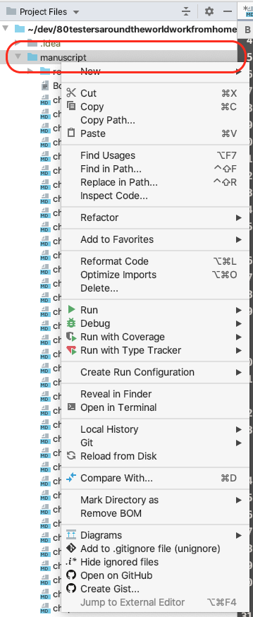
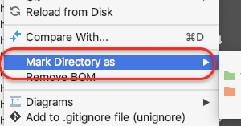
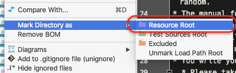

# Fill in a REAL README

## Important

Notice how you _can_ have colours set in a span. — I think this will only work in a README.md
The chapter files are actually not _really_  Markdown files, however many IDEs and text editors recognise the format and can highlight syntax elements. LeanPub's `Markua` markup language is close enough in most cases.

* The default branch may be **`main`**. This is because that branch ist what LeanPub will check out (well, if configured to).
If in doubt you can _tag_ commits.

    

* **Before you push to Github** -> **pull from GitHub**, use `git pull --rebase`.
  For an explanation, read [https://megakemp.com/2019/03/20/the-case-for-pull-rebase/](https://megakemp.com/2019/03/20/the-case-for-pull-rebase/).
* When/if you'd like to **review** work from others, please ask the author before giving your feedback.
* Along the same line: Feel free to ask other contributors for feedback & proof reading.

## How to contribute to this repository

[Stephan](https://github.com/s2K) wrote a [blog post about his ebook 'Fast Feedback Using Ruby'](https://seasidetesting.com/2020/03/28/writing-a-ruby-related-book-on-leanpub/). This is essentially how you can set up you book writing project as well, including the auto-generation of preview versions of the book and moving that to a Dropbox folder.

* The manual for writing using `Markua` the markup language used by LeanPub is available at <https://leanpub.com/markua/read>
  In case you work with several people on different chapters, to make things easy for everyone: **Please use `git pull --rebase`** when, well, pulling changes from GitHub.
* Please take care to not add and commit configuration files that your tool might leave behind in the folder structure.
* Write, commit and push as you see fit.
  * When working as a group: **Do not push** on every save, as LeanPub may be set up to generate a new preview version upon a push to the Git repository. Having (potentially) 80 people writing and pushing changes might overwhelm LeanPub. Of course when you write solo, do as you like.

## Tips for writing in Markua

* For some short info about Markua see [How to Write a Novel in Markua](https://leanpub.com/markua/read#leanpub-auto-how-to-write-a-novel-in-markua) and [How to Write a Computer Programming Book in Markua](https://leanpub.com/markua/read#leanpub-auto-how-to-write-a-computer-programming-book-in-markua)
* If you *can* configure your editor/IDE to recognise `manuscript` as a 'resource', then you can (likely) follow links to other files easily.
  Here's how it can be done in RubyMine:
  1. Hover the mouse pointer over the `manuscript` folder …
  1. Right-click it

     
  1. Move  mouse pointer to 'Mark directory as' and click _that

     .

     Then …
  1. Click 'Resource root'

     
  1. Do the same with the `resources` folder inside manuscript.

